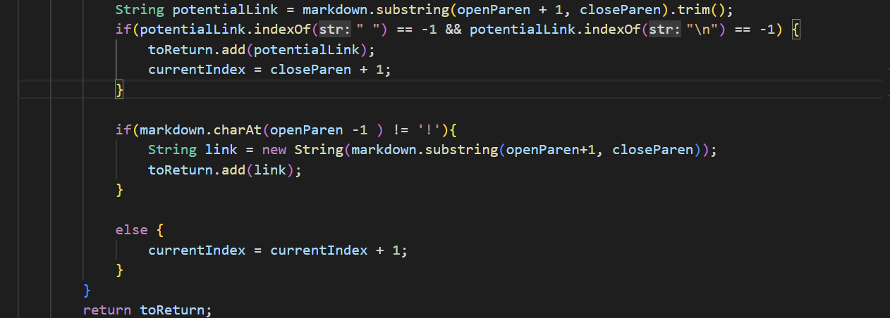

# Lab Report 5 
### Name: Tianhao Chen(A16875083)

## How I found different results
1. Run `bash script.sh > results.txt` on both repos. After that, we will get two `results.txt`.

2. Then we can use `vimdiff my-markdown/results.txt markdown-parser/results.txt` to get the different  part between two result, which will be marked with color.

## 194.md
 - Different results

Here is the link to the test:
[194](https://github.com/Cthloveross/lab9-markdown/blob/main/test-files/194.md)
 
 Instead of using `vimdiff` and `diff`, I run the test file `194.md` manually on my implementation and class implementation separately, and then I compared their results.

 
 

- How to fix it

After comparing the two different results, I shall believe mine might be the correct one. There is a `:` and some texts outside the parentheses and behind the `closeBracket` in this test, so the link is not valid. Therfore, we need to add a if statement to check whether there is texts between `closebracket` and `openParen`. Also, `openParen` should be after the `closeBracket`.

Here is the code can be changed.

## 571.md
 - Different results

Here is the link to the test:
[571](https://github.com/Cthloveross/labreport5/blob/main/571.md)

 Instead of using `vimdiff` and `diff`, I run the test file `571.md` manually on my implementation and class implementation separately, and then I compared their results.

- How to fix it

After comparing the two results, I shall believe the implement from professor is right, which should be `[]`. To solve this problem, we need to create a new if statement to check whether there is `!` before `[`. If `!` is existed, it means it does not satisfy the link format, then we cannot add it to `toReturn`.

Here is the possible change I made:

